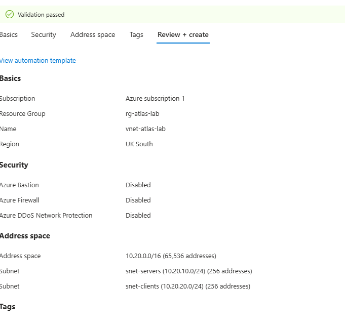
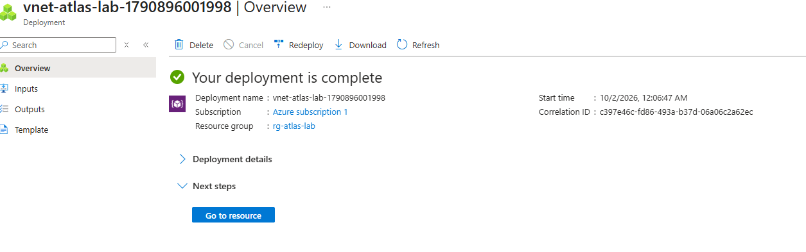
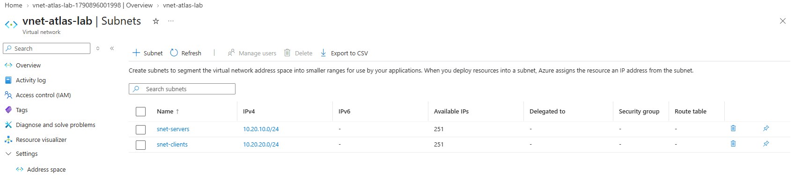
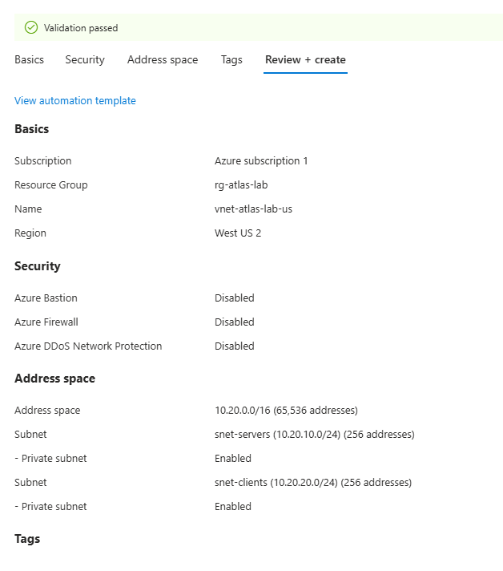
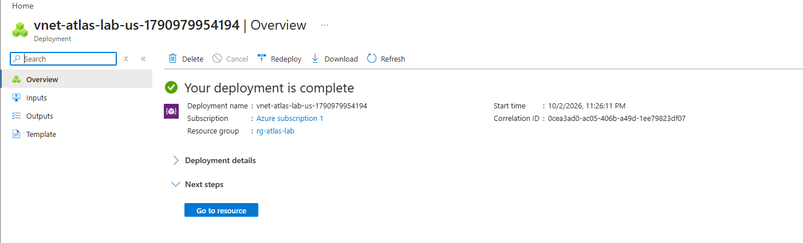
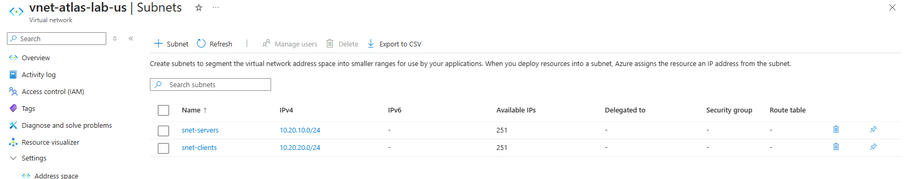

# LAB-001 — Azure Virtual Network Foundation

## Project

**Project Atlas — Hybrid Infrastructure**

## Objective

Design and deploy the foundational Azure network for a fictional enterprise environment.

The objective of this lab was to create a dedicated Azure Virtual Network (VNet) and segment server and client workloads into separate subnets, providing the network foundation for later Windows Server, Active Directory, DNS, Group Policy, identity, access-control and infrastructure troubleshooting labs.

---

## Architecture

```text
Azure Subscription
│
└── rg-atlas-lab
    │
    └── vnet-atlas-lab
        │
        ├── snet-servers
        │   └── 10.20.10.0/24
        │       └── DC01 [Planned]
        │
        └── snet-clients
            └── 10.20.20.0/24
                └── CL01 [Planned]
```

---

## Configuration

| Component | Configuration |
|---|---|
| Azure Region | UK South |
| Resource Group | `rg-atlas-lab` |
| Virtual Network | `vnet-atlas-lab` |
| VNet Address Space | `10.20.0.0/16` |
| Server Subnet | `snet-servers` |
| Server Subnet CIDR | `10.20.10.0/24` |
| Client Subnet | `snet-clients` |
| Client Subnet CIDR | `10.20.20.0/24` |
| Azure Bastion | Disabled |
| Azure Firewall | Disabled |
| DDoS Network Protection | Disabled |
| NAT Gateway | Not configured at this stage |
| Network Security Groups | Not configured at this stage |

---

## Implementation

### 1. Resource Group

Created a dedicated Azure resource group:

`rg-atlas-lab`

The resource group provides a logical management boundary for the resources used throughout the Atlas hybrid infrastructure environment.

### 2. Virtual Network

Created the virtual network:

`vnet-atlas-lab`

Configured the private IPv4 address space as:

`10.20.0.0/16`

Azure initially proposed a default address space and subnet. These defaults were deliberately replaced with the addressing scheme defined for the Atlas architecture.

### 3. Network Segmentation

The VNet was segmented into two dedicated `/24` subnets.

#### Server Subnet

**Name:** `snet-servers`  
**CIDR:** `10.20.10.0/24`

This subnet is reserved for server infrastructure, beginning with the planned Windows Server `DC01`.

`DC01` will later be configured to provide Active Directory Domain Services and DNS functionality for the Atlas environment.

#### Client Subnet

**Name:** `snet-clients`  
**CIDR:** `10.20.20.0/24`

This subnet is reserved for client systems, including the planned Windows client `CL01`.

Separating server and client workloads provides a foundation for later network security, access-control and troubleshooting exercises.

---

## Validation

The VNet deployment completed successfully in Microsoft Azure.

Post-deployment validation confirmed:

- `vnet-atlas-lab` exists within `rg-atlas-lab`
- The VNet address space is `10.20.0.0/16`
- `snet-servers` is deployed as `10.20.10.0/24`
- `snet-clients` is deployed as `10.20.20.0/24`
- Both subnets are available for future workloads
- The automatically generated default subnet was removed
- The deployed configuration matches the planned Atlas network architecture

---

## Key Learning

This lab demonstrated the importance of designing cloud networking deliberately rather than relying entirely on automatically generated defaults.

Key concepts applied during the lab included:

- Azure Resource Groups
- Azure Virtual Networks
- Private IPv4 addressing
- CIDR notation
- Subnetting
- Network segmentation
- Server and client workload separation
- Azure resource deployment
- Post-deployment validation

The `10.20.0.0/16` VNet provides the overall private network address space, while dedicated `/24` subnets create logical network boundaries for different workload types.

---

## Troubleshooting and Engineering Decisions

During configuration, Azure automatically generated default networking values.

Rather than accepting these defaults, the network configuration was reviewed and changed to match the planned Atlas architecture.

The default subnet was removed and replaced with:

- `snet-servers` — `10.20.10.0/24`
- `snet-clients` — `10.20.20.0/24`

This ensured that the deployed environment matched the intended design before additional infrastructure was introduced.

---

## Evidence

The following evidence was captured during the implementation and validation of the Azure network foundation.

### E001 — VNet Pre-Deployment Validation

The final configuration was reviewed and successfully validated before deployment. This confirms the planned `10.20.0.0/16` address space and the dedicated server and client subnets.



### E002 — Successful VNet Deployment

Azure confirmed that the deployment of `vnet-atlas-lab` completed successfully within `rg-atlas-lab`.



### E003 — Deployed Subnet Validation

Post-deployment validation confirmed that both planned subnets were successfully created:

- `snet-servers` — `10.20.10.0/24`
- `snet-clients` — `10.20.20.0/24`



> **Security Note:** Public evidence has been reviewed to avoid exposing Azure subscription identifiers, credentials, personal information, employer information or other unnecessary account-specific data.

---
---

## Architecture Update — Regional Redeployment

During preparation for the next phase of the lab, Azure VM availability was evaluated for the original UK South deployment.

The required lab-sized Windows Server VM SKUs were unavailable for this subscription in UK South. To continue the infrastructure build while preserving the original network design, the network foundation was redeployed in West US 2.

The original UK South deployment has been retained as evidence of the initial implementation.

## Updated Architecture

```text
Azure Subscription
│
└── rg-atlas-lab
    │
    └── vnet-atlas-lab-us
        │
        ├── snet-servers
        │   └── 10.20.10.0/24
        │       └── DC01 [Planned]
        │
        └── snet-clients
            └── 10.20.20.0/24
                └── CL01 [Planned]
```

## Updated Configuration

**Azure Region:** West US 2

**Resource Group:** `rg-atlas-lab`

**Virtual Network:** `vnet-atlas-lab-us`

**VNet Address Space:** `10.20.0.0/16`

**Server Subnet:** `snet-servers`

**Server Subnet CIDR:** `10.20.10.0/24`

**Client Subnet:** `snet-clients`

**Client Subnet CIDR:** `10.20.20.0/24`

The logical IP addressing and subnet segmentation were intentionally preserved during the regional redeployment. Only the Azure region and VNet resource name changed.

## Validation

The replacement virtual network successfully passed Azure pre-deployment validation and was deployed in West US 2.

Post-deployment validation confirmed:

- `vnet-atlas-lab-us` uses the intended `10.20.0.0/16` address space.
- `snet-servers` is configured as `10.20.10.0/24`.
- `snet-clients` is configured as `10.20.20.0/24`.
- Both subnets are available for the next stages of the infrastructure build.

## Evidence

### E004 — West US 2 Pre-Deployment Validation

The replacement VNet configuration successfully passed Azure validation before deployment.



### E005 — West US 2 VNet Deployment

Azure confirmed successful deployment of `vnet-atlas-lab-us` within `rg-atlas-lab`.



### E006 — West US 2 Subnet Validation

Post-deployment validation confirmed the dedicated server and client subnets.



## Engineering Decision

The regional redeployment demonstrates an important infrastructure principle: preserve the intended architecture while adapting implementation details to platform constraints.

The Atlas network design remains:

`VNet → Server Subnet + Client Subnet → Workload Segmentation`

West US 2 will be used as the deployment region for the subsequent compute resources in this lab.

## Skills Demonstrated

- Microsoft Azure
- Azure Virtual Network administration
- IPv4 addressing
- CIDR and subnetting
- Network segmentation
- Cloud infrastructure design
- Azure resource management
- Infrastructure validation
- Technical documentation

---

## Result

**LAB-001 Status: COMPLETE ✅**

The Azure network foundation has been successfully deployed and validated.

The environment is now ready for the first server workload.

---

## Next Lab

### LAB-002 — DC01 Windows Server Deployment & Network Configuration

The next lab will deploy the first Windows Server virtual machine into:

`snet-servers — 10.20.10.0/24`

The server will be prepared for its later role as:

- Active Directory Domain Controller
- DNS Server
- Core identity infrastructure for the Atlas hybrid environment

---

## Project Disclaimer

This project represents a self-directed fictional enterprise lab created for technical learning and portfolio development.

It does not represent or disclose the infrastructure, systems, configurations or internal processes of any current or previous employer.
