# LAB-003 — Active Directory Domain Services & DNS

## Overview

This lab extends the Atlas hybrid infrastructure environment by transforming `DC01` into the first Active Directory Domain Controller for the environment.

Active Directory Domain Services (AD DS) and DNS were deployed on Windows Server 2022, creating the new `corp.atlas.local` forest and domain.

The deployment was validated using Active Directory Users and Computers, DNS Manager, DNS name resolution testing, domain controller diagnostics, and SYSVOL/NETLOGON share verification.

---

## Lab Objectives

- Install the Active Directory Domain Services role
- Promote `DC01` to a Domain Controller
- Create a new Active Directory forest
- Configure the `corp.atlas.local` domain
- Integrate DNS with Active Directory
- Validate the Domain Controller after promotion
- Validate Active Directory-integrated DNS
- Test DNS name resolution
- Perform Domain Controller health checks
- Verify SYSVOL and NETLOGON availability

---

## Environment

**Azure Region:** West US 2  
**Resource Group:** `rg-atlas-lab`  
**Server:** `DC01`  
**Operating System:** Windows Server 2022 Datacenter: Azure Edition  
**Private IP Address:** `10.20.10.10`  
**Domain:** `corp.atlas.local`  
**NetBIOS Domain:** `CORP`

---

## 1. Active Directory Domain Services Installation

The Active Directory Domain Services role was installed on `DC01` using Windows Server Manager.

The correct server was selected from the server pool before adding the AD DS server role.

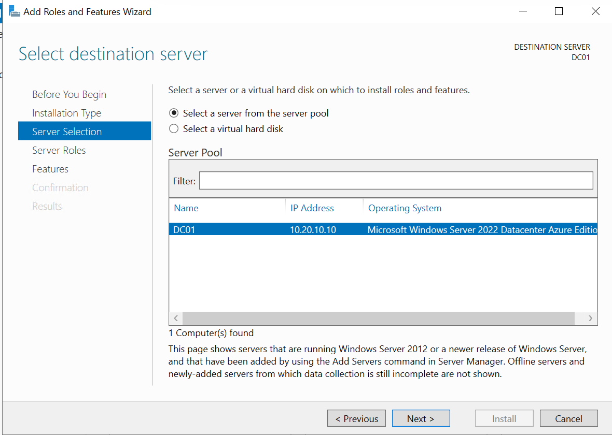

The Active Directory Domain Services role was then selected.

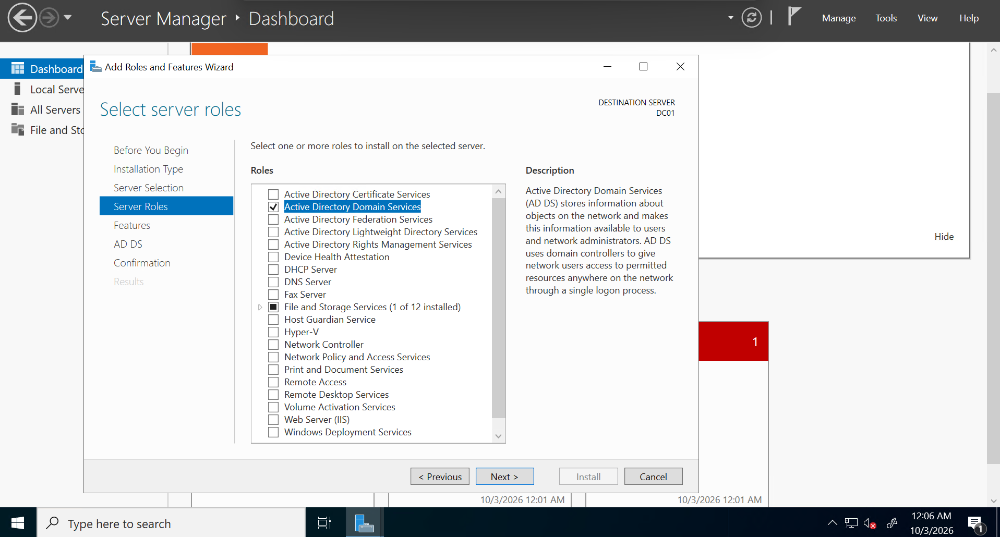

The installation configuration was reviewed before deployment.

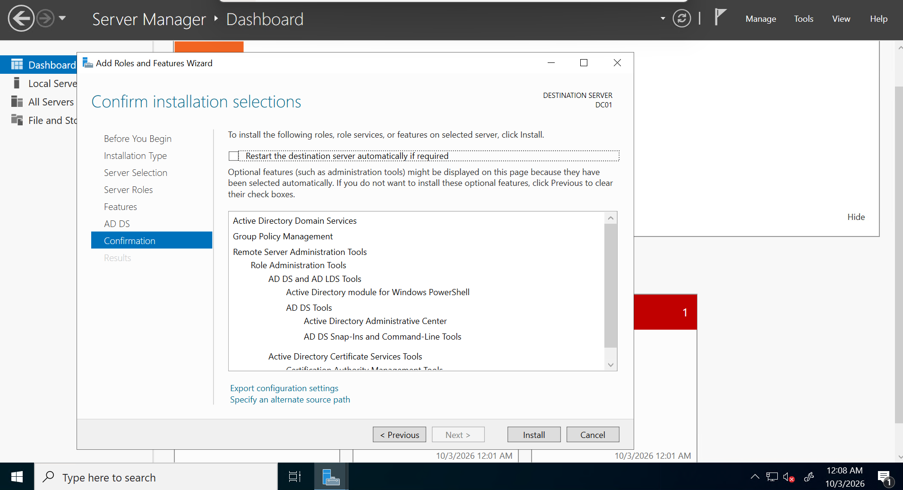

The AD DS role installation completed successfully.

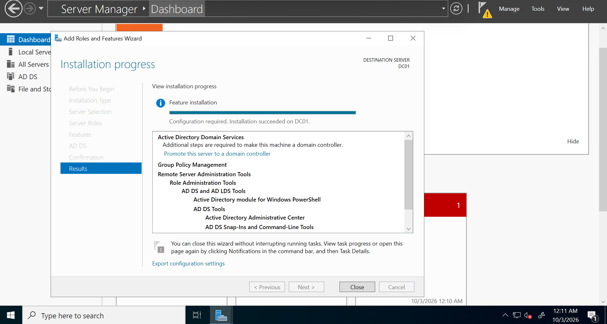

---

## 2. New Active Directory Forest

Following installation of the AD DS role, `DC01` was promoted to a Domain Controller.

A new forest was created using:

`corp.atlas.local`

This server became the first Domain Controller in the Atlas lab environment.

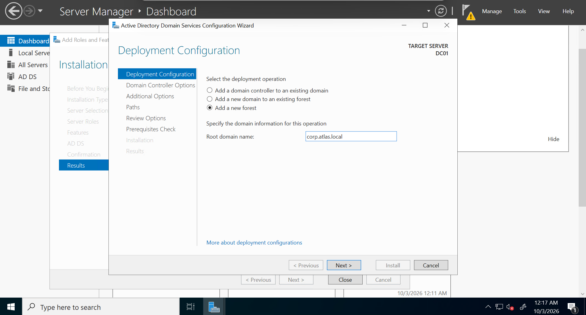

The Domain Controller configuration was reviewed before promotion.

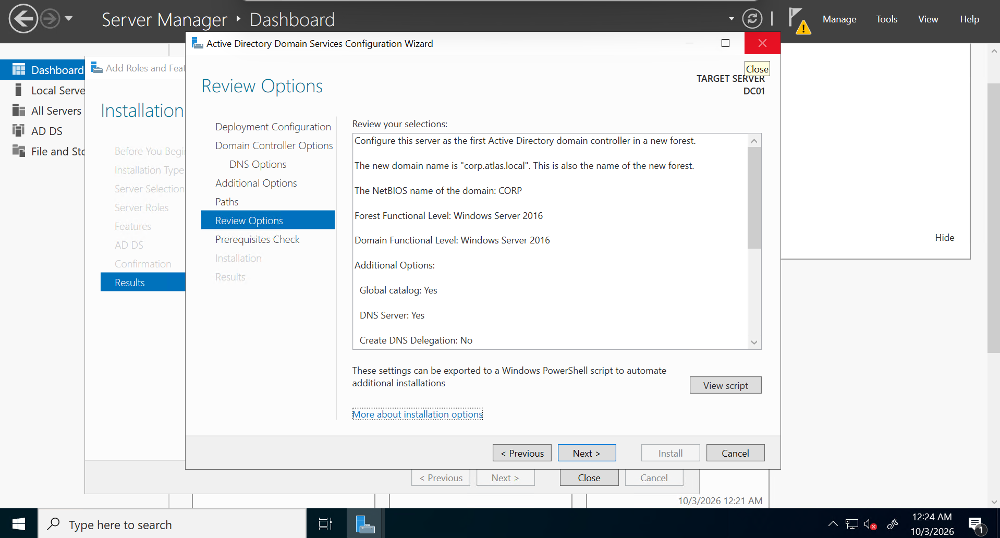

Prerequisite checks completed successfully before installation.

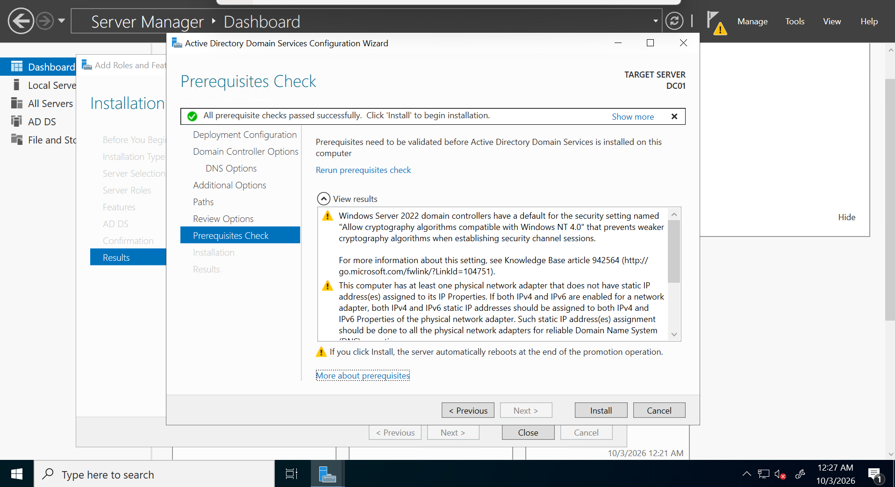

---

## 3. Domain Controller Validation

Following promotion and restart, `DC01` successfully joined the newly created `corp.atlas.local` domain as its Domain Controller.

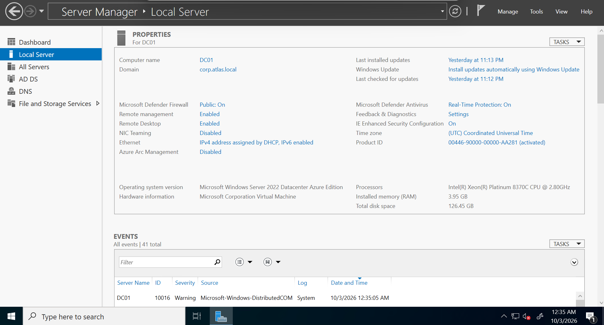

Active Directory Users and Computers was used to verify the domain and confirm that `DC01` appeared within the Domain Controllers organizational unit.

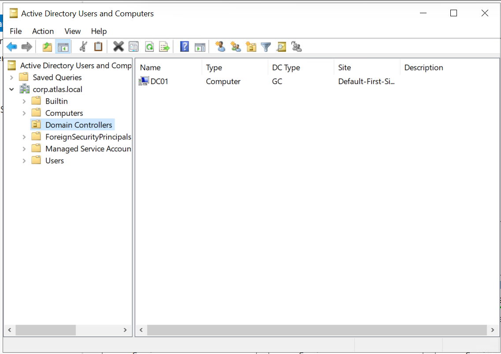

---

## 4. DNS Validation

DNS was installed as part of the Domain Controller deployment.

DNS Manager was used to verify the Active Directory-integrated DNS zones, including:

- `_msdcs.corp.atlas.local`
- `corp.atlas.local`

The `corp.atlas.local` zone contained the required Active Directory DNS records and a host record for `DC01` resolving to `10.20.10.10`.

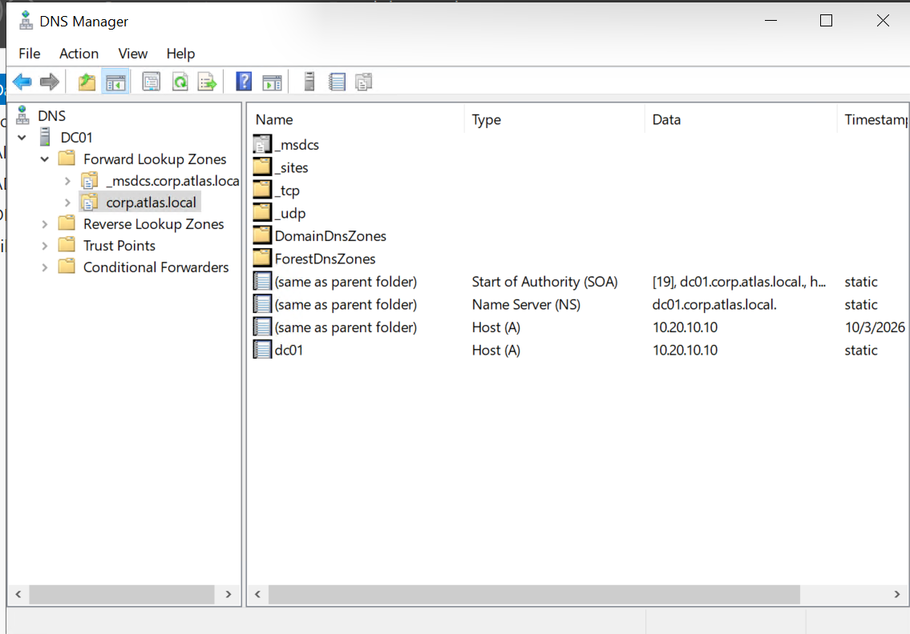

DNS name resolution was tested using:

`nslookup dc01.corp.atlas.local`

The query successfully resolved:

`dc01.corp.atlas.local` → `10.20.10.10`

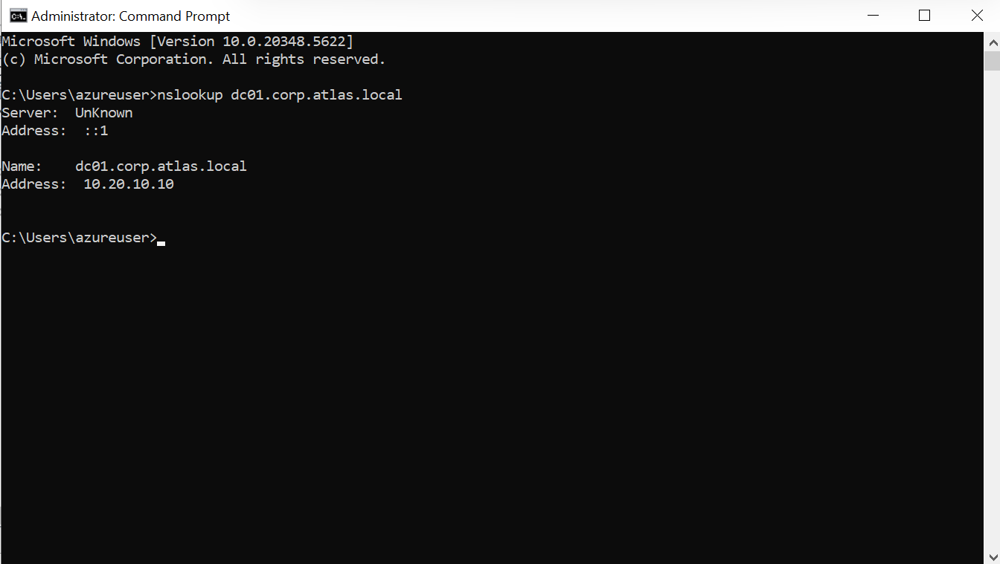

---

## 5. Active Directory Health Validation

Domain Controller health was validated using:

`dcdiag`

The diagnostic tests completed successfully, providing validation that the Domain Controller and Active Directory services were operational.

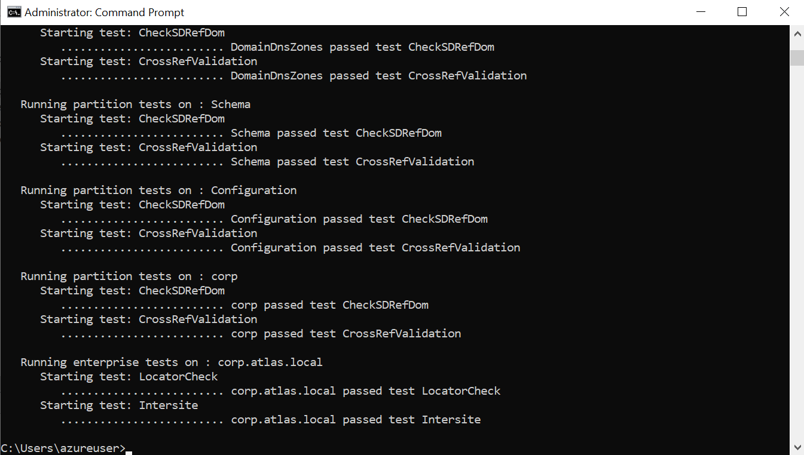

---

## 6. SYSVOL and NETLOGON Validation

The availability of the standard Domain Controller shares was verified using:

`net share`

The results confirmed that both `SYSVOL` and `NETLOGON` were available.

These shares are required for core Active Directory functionality, including Group Policy distribution and domain logon processes.

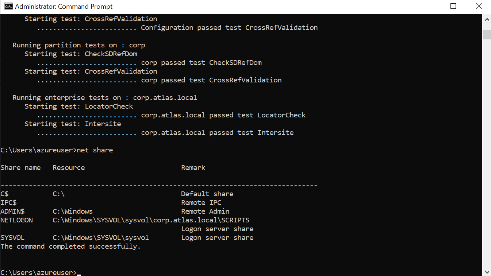

---

## Validation Summary

The following components were successfully validated:

- Active Directory Domain Services installed
- `DC01` promoted to Domain Controller
- New `corp.atlas.local` forest created
- Active Directory-integrated DNS operational
- `DC01` DNS resolution successful
- Domain Controller health checks passed
- SYSVOL available
- NETLOGON available

---

## Skills Demonstrated

- Windows Server 2022 administration
- Active Directory Domain Services
- Domain Controller deployment
- Active Directory forest and domain configuration
- Windows DNS administration
- DNS troubleshooting and validation
- Domain Controller diagnostics
- Windows Server command-line validation
- Enterprise infrastructure documentation

---

## Outcome

`DC01` is now operating as the first Domain Controller and DNS server for the Atlas environment.

The `corp.atlas.local` Active Directory domain provides the identity and authentication foundation required for subsequent identity management, access control, domain-joined systems, and Group Policy implementation.
