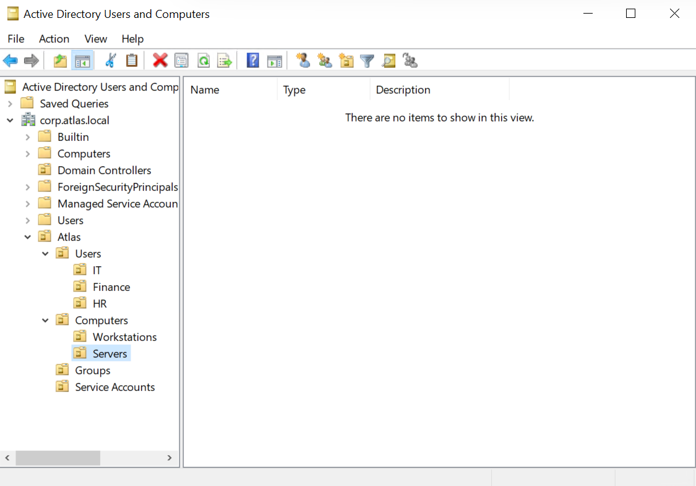
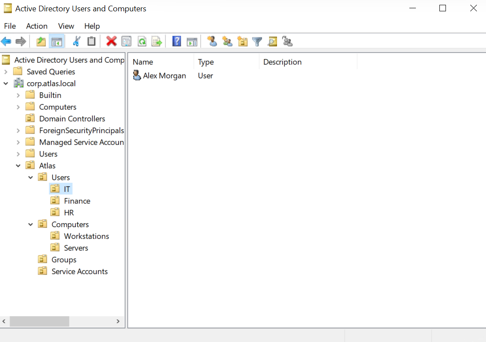
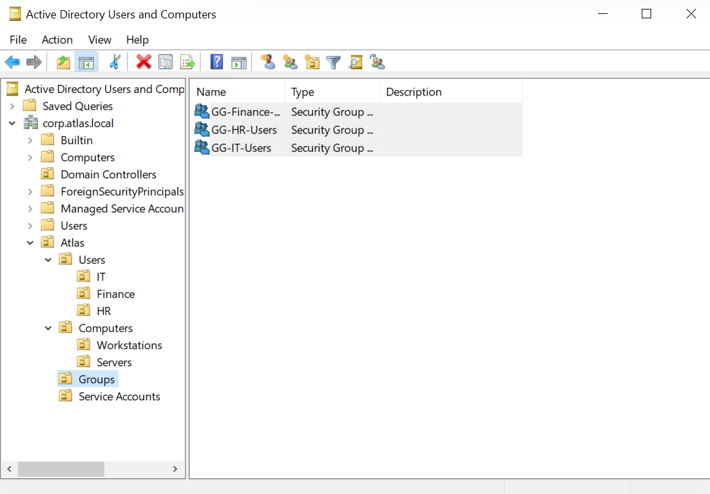
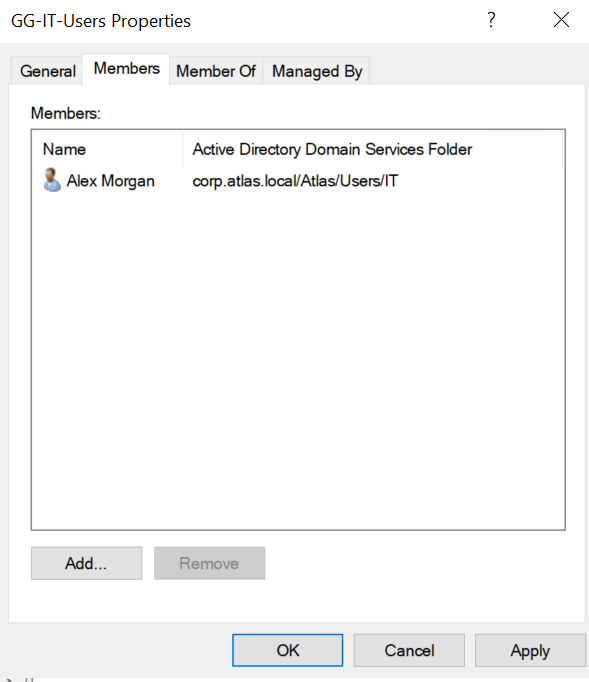
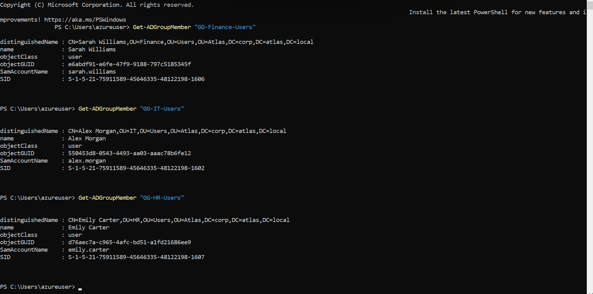

# LAB-004 — Active Directory Identity & Access Management

## Overview

This lab builds on the `corp.atlas.local` Active Directory environment established in LAB-003.

The objective was to implement an enterprise-style identity and access management structure using Organizational Units (OUs), departmental user accounts, and Global Security Groups.

The configuration separates users, computers, groups, and service accounts into dedicated administrative structures while organizing users by department.

Security group membership was validated through both Active Directory Users and Computers and PowerShell.

---

## Lab Objectives

- Design an enterprise-style Organizational Unit structure
- Separate users, computers, groups, and service accounts
- Organize user accounts by department
- Create departmental Active Directory user accounts
- Create Global Security Groups
- Assign departmental users to appropriate security groups
- Validate group membership through Active Directory
- Validate group membership using PowerShell

---

## Environment

**Domain Controller:** `DC01`  
**Active Directory Domain:** `corp.atlas.local`  
**NetBIOS Domain:** `CORP`  
**Domain Controller IP:** `10.20.10.10`  
**Operating System:** Windows Server 2022 Datacenter: Azure Edition

---

## 1. Organizational Unit Design

A top-level `Atlas` Organizational Unit was created to provide a structured administrative boundary for lab-managed Active Directory objects.

The following OU structure was implemented:

    Atlas
    ├── Users
    │   ├── IT
    │   ├── Finance
    │   └── HR
    ├── Computers
    │   ├── Workstations
    │   └── Servers
    ├── Groups
    └── Service Accounts

This structure separates object types while allowing users to be organized by department.

It also provides a foundation for future Group Policy targeting and administrative delegation.

---

## 2. Departmental User Provisioning

Departmental user accounts were created within their corresponding OUs.

The following lab users were provisioned:

- Alex Morgan — IT
- Sarah Williams — Finance
- Emily Carter — HR

For example, Alex Morgan was created within:

`corp.atlas.local/Atlas/Users/IT`

with the user principal name:

`alex.morgan@corp.atlas.local`

and legacy logon identity:

`CORP\alex.morgan`

---

## 3. Departmental Security Groups

Global Security Groups were created within the `Atlas/Groups` OU to provide group-based access management.

The following groups were created:

- `GG-IT-Users`
- `GG-Finance-Users`
- `GG-HR-Users`

Each group was configured as:

- **Group Scope:** Global
- **Group Type:** Security

Using security groups allows permissions and access controls to be assigned to groups rather than directly to individual users.

---

## 4. Security Group Membership

Each departmental user was assigned to the corresponding Global Security Group:

- Alex Morgan → `GG-IT-Users`
- Sarah Williams → `GG-Finance-Users`
- Emily Carter → `GG-HR-Users`

Active Directory Users and Computers was used to verify the membership configuration.

The following evidence demonstrates Alex Morgan's membership in `GG-IT-Users`.

---

## 5. PowerShell Membership Validation

Security group membership was independently validated using the Active Directory PowerShell module.

The following commands were executed:

    Get-ADGroupMember "GG-Finance-Users"
    Get-ADGroupMember "GG-IT-Users"
    Get-ADGroupMember "GG-HR-Users"

The results confirmed:

- `GG-Finance-Users` contains Sarah Williams
- `GG-IT-Users` contains Alex Morgan
- `GG-HR-Users` contains Emily Carter

This provided command-line validation that each departmental user had been assigned to the intended security group.

---

## Validation Summary

The following components were successfully implemented and validated:

- Enterprise-style OU hierarchy created
- Dedicated Users OU created
- Dedicated Computers OU created
- Dedicated Groups OU created
- Dedicated Service Accounts OU created
- IT, Finance, and HR departmental OUs created
- Workstations and Servers OUs created
- Departmental user accounts provisioned
- Global Security Groups created
- Users assigned to corresponding departmental groups
- Group membership validated through Active Directory
- Group membership independently validated using PowerShell

---

## Skills Demonstrated

- Active Directory administration
- Organizational Unit design
- Identity lifecycle administration
- Active Directory user provisioning
- Security group administration
- Group-based access management
- PowerShell
- Active Directory PowerShell module
- Infrastructure validation
- Enterprise identity management
- Technical documentation

---

## Outcome

The `corp.atlas.local` domain now contains a structured identity and access management model for the Atlas environment.

Users are organized according to departmental function and assigned to Global Security Groups that can subsequently be used for resource permissions and access control.

The OU structure also establishes the administrative foundation required for domain-joined workstations and Group Policy implementation in subsequent labs.
