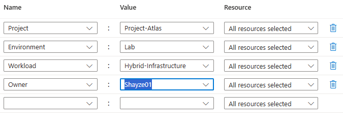
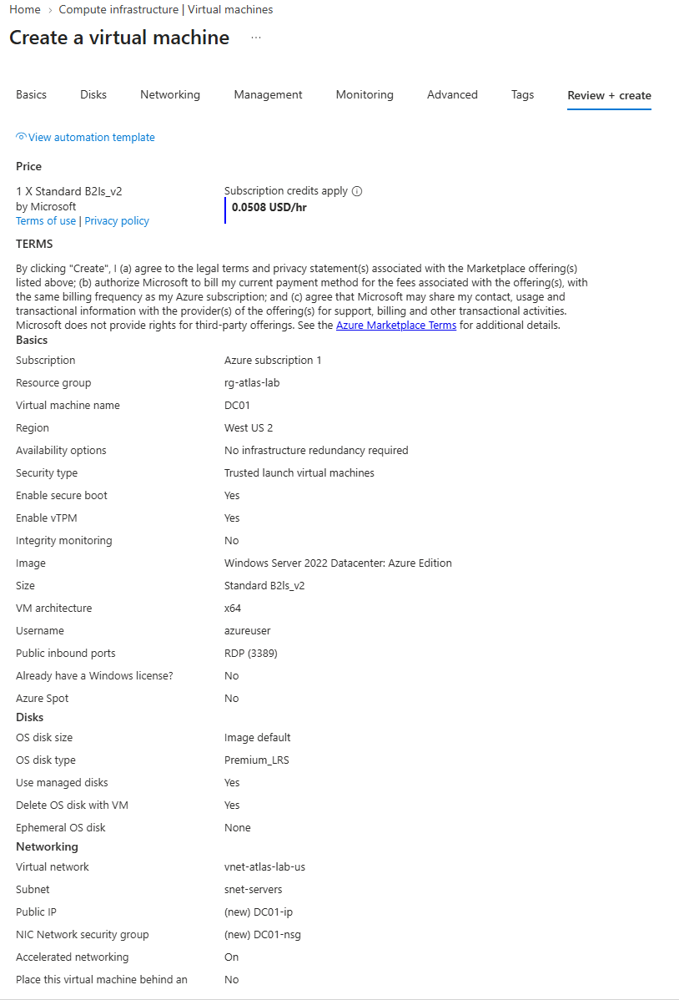
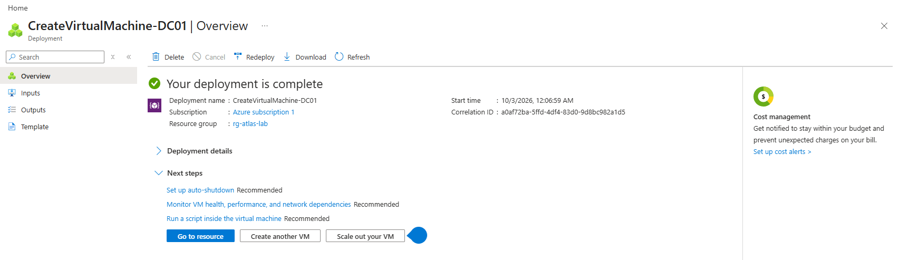
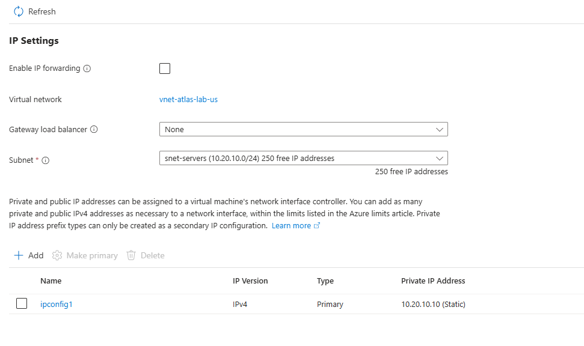
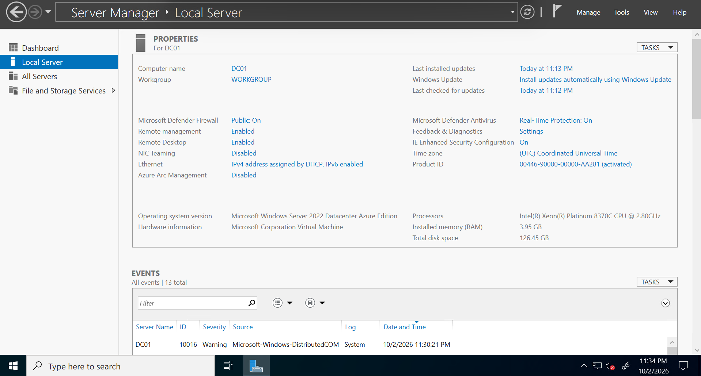
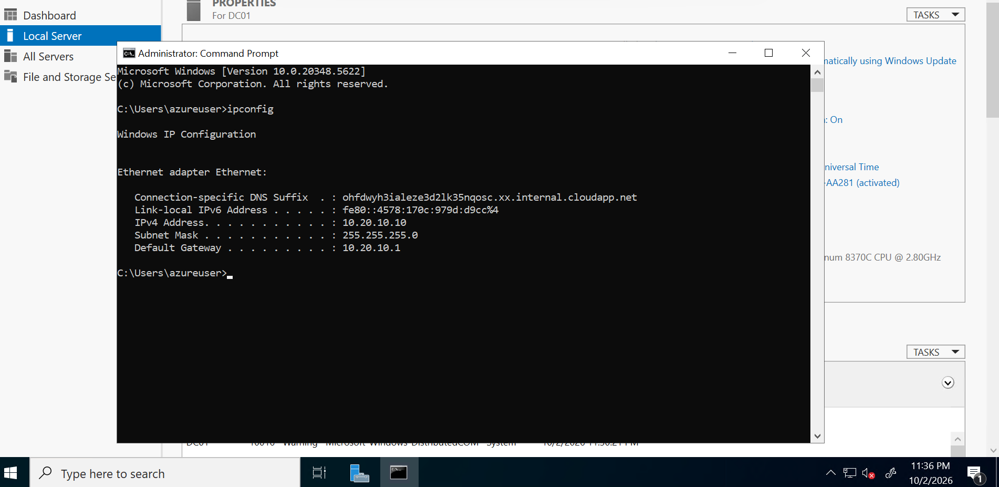

# LAB-002 Evidence — DC01 Windows Server Deployment

This directory contains implementation and validation evidence for LAB-002 of Project Atlas.

LAB-002 demonstrates the deployment and configuration of the first Windows Server virtual machine, **DC01**, within the Atlas Azure infrastructure.

---

## E007 — Resource Tagging

The Azure resources associated with DC01 were configured with standardized tags:

- Project: `Project-Atlas`
- Environment: `Lab`
- Workload: `Hybrid-Infrastructure`
- Owner: `Shayze01`

This demonstrates structured resource governance and consistent resource classification.

---

## E008 — Pre-Deployment Validation

Azure VM configuration was reviewed before deployment.

The validated configuration included:

- Virtual machine: `DC01`
- Region: `West US 2`
- Operating system: Windows Server 2022 Datacenter: Azure Edition
- VM size: `Standard_B2ls_v2`
- Virtual network: `vnet-atlas-lab-us`
- Server subnet: `snet-servers`
- Trusted Launch security
- RDP connectivity
- Automatic shutdown configuration

This checkpoint verifies that the intended infrastructure configuration was reviewed before provisioning.

---

## E009 — Successful VM Deployment

Azure successfully completed the deployment of the DC01 virtual machine and its associated resources.

This confirms successful provisioning of the Windows Server compute workload within the Project Atlas Azure environment.

---

## E010 — Static Private IP Configuration

The primary network interface for DC01 was configured with the static private IPv4 address:

`10.20.10.10`

DC01 resides within:

- VNet: `vnet-atlas-lab-us`
- Subnet: `snet-servers`
- Subnet range: `10.20.10.0/24`

A stable private IP is required because DC01 will provide infrastructure services that other systems must consistently locate.

---

## E011 — Windows Server Validation

Successful Remote Desktop access to DC01 was established and Windows Server Manager was used to validate the deployed server.

The server was confirmed as:

- Computer name: `DC01`
- Operating system: Microsoft Windows Server 2022 Datacenter Azure Edition
- Remote Desktop: Enabled
- Microsoft Defender Firewall: Enabled
- Remote management: Enabled

This confirms successful administrative access to the Windows Server guest operating system.

---

## E012 — Guest Network Validation

Windows `ipconfig` was used inside DC01 to validate the network configuration from the guest operating system.

Validated configuration:

- IPv4 address: `10.20.10.10`
- Subnet mask: `255.255.255.0`
- Default gateway: `10.20.10.1`

This provides end-to-end confirmation that the static private IP configured through Azure is correctly presented to the Windows Server guest.

---

## LAB-002 Validation Summary

LAB-002 successfully established the first Windows Server workload within the Project Atlas environment.

The implementation demonstrates:

- Azure Windows Server VM deployment
- Resource tagging and governance
- VNet and subnet integration
- Static private IP configuration
- Remote administrative access
- Guest operating system validation
- Network configuration verification

DC01 is now prepared for the next infrastructure stage: **Active Directory Domain Services and DNS configuration**.
